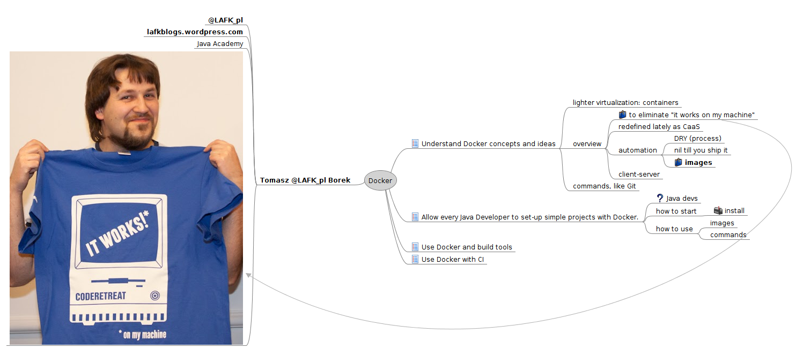
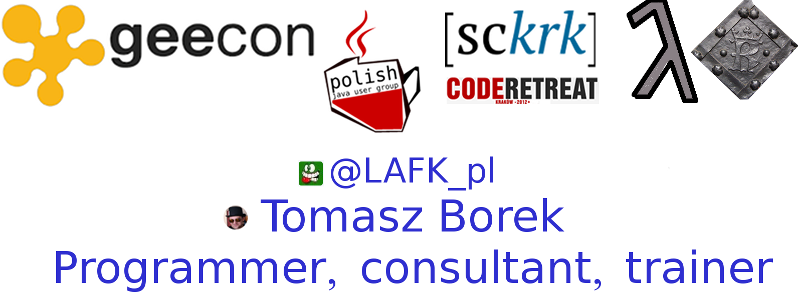
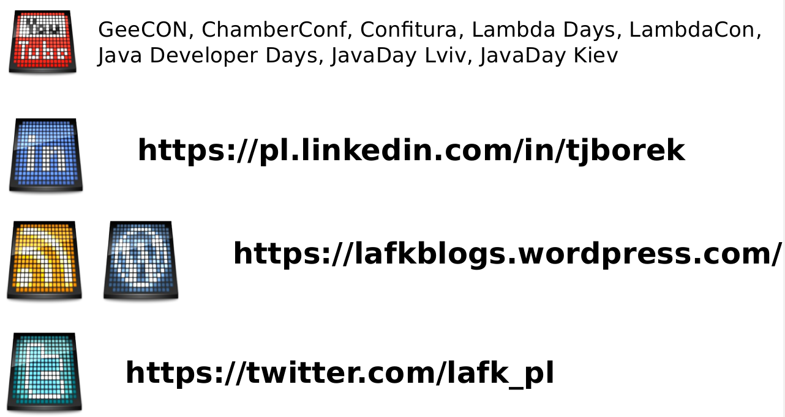
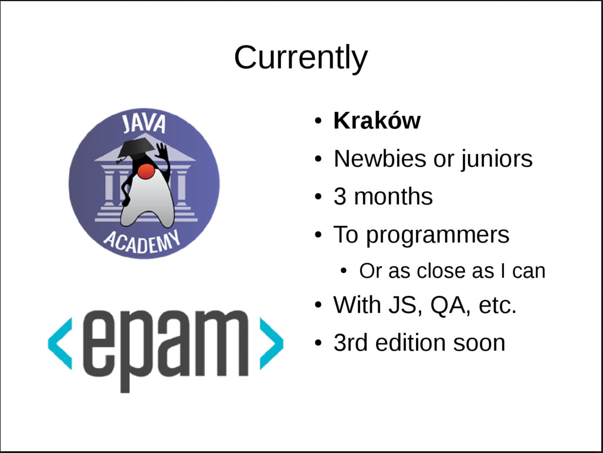

# Docker intro workshop

Here you will find:

1. info about me
2. link to Docker docs (and other, relevant things)
3. exercises

## Agenda

## Me?

## Overview

1. [Docker overview - official site](https://docs.docker.com/engine/docker-overview/)
2. [Docker in 12 minutes by Jake Wright](https://www.youtube.com/watch?time_continue=3&v=YFl2mCHdv24)

## Basic Test!

1. What is Docker?
2. What is a container?
3. What is a VM?
4. How is VM and container different?

## Dev Test!

5. Docker architecture?
6. Docker hub?
7. Docker image, container, file?
8. Technologies behind Docker?
9. Language Docker is written in?

## User  Test!

10. How to install Docker on Windows?
11. How to install Docker on GNU/Linux?
12. Do I install from packages (apt, yum, etc.)?
13. Docker Engine, Machine, toolbox?
14. EE, CE?
15. Running a container?

