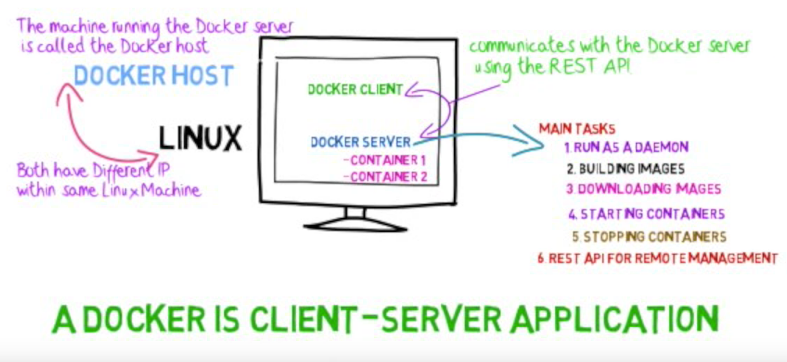
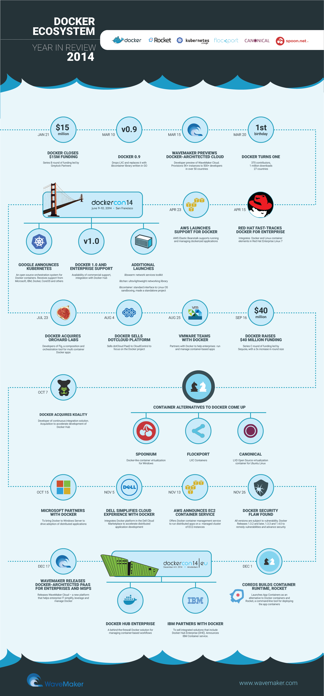
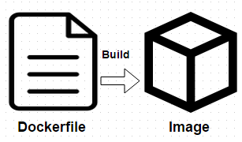
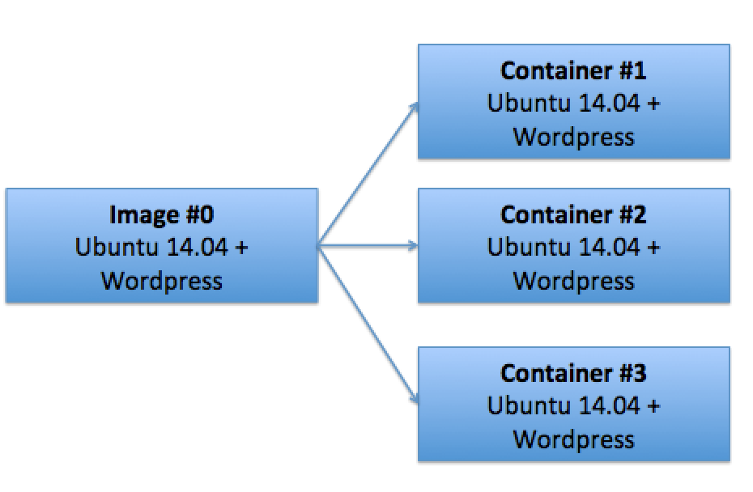
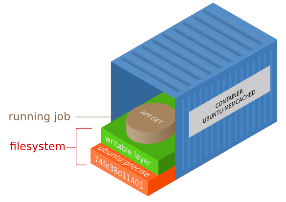
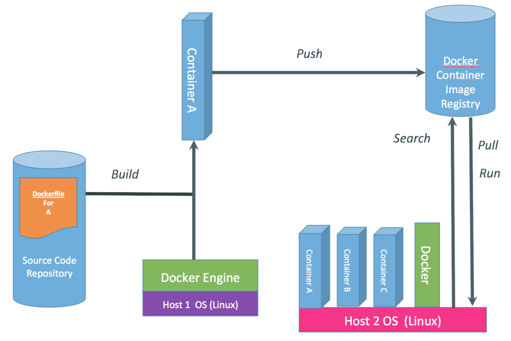

# Docker intro workshop

Here you will find:

1. info about me
2. link to Docker docs (and other, relevant things)
3. exercises

## Agenda

## Me?

## Overview

[Docker overview - official site](https://docs.docker.com/engine/docker-overview/)

> for good communication to know that "Docker" is an adjective, not a noun. You can't have "a Docker" because that doesn't tell you if you're talking about a Docker container (a process tree running within a namespace, complete with its own networking and file system), a Docker daemon (which manages the Docker containers), a Docker CLI (which talks to a Docker daemon), or a Docker image (which is template for a Docker container, including a read-only file system for any containers that start from the image). "A Docker" doesn't mean anything, because you could have the images without the daemon, the daemon without images or containers, the CLI without anything else

### Brief history

from https://www.wavemaker.com/portfolio-item/docker-ecosystem-year-in-review-2014/

## Images, Dockerfiles, Containers

1. Dockerfile is a text file
2. It's called `Dockerfile`, **D**
3. It uses it's own keywords `RUN`, `CMD`, `EXPOSE`, `FROM`
4. It forms an image
5. Image is like a snapshot of a system
6. Image is a template according to which we start the container
7. Container is a process tree (chroot and all that)
8. Containers are not mutable (are **IMM**utable)

[Docker images and containers overview](https://docs.docker.com/engine/userguide/storagedriver/imagesandcontainers/)

### Commands

## Basic Test!

1. What is Docker?
2. What is a container?
3. What is a VM?
4. How is VM and container different?

## Dev Test!

5. Docker architecture?
6. Docker hub?
7. Docker image, container, file?
8. Technologies behind Docker?
9. Language Docker is written in?

## User  Test!

10. How to install Docker on Windows?
11. How to install Docker on GNU/Linux?
12. Do I install from packages (apt, yum, etc.)?
13. Docker Engine, Machine, toolbox?
14. EE, CE?
15. Running a container?

